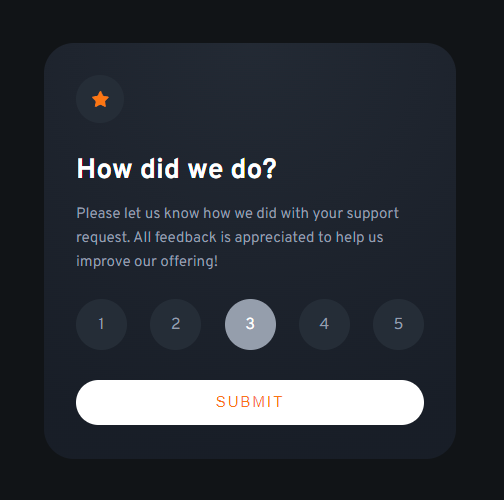
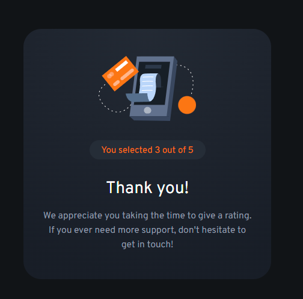
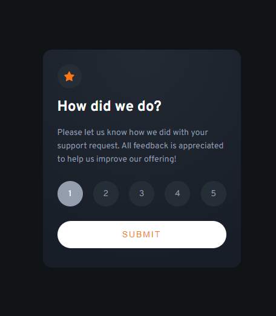
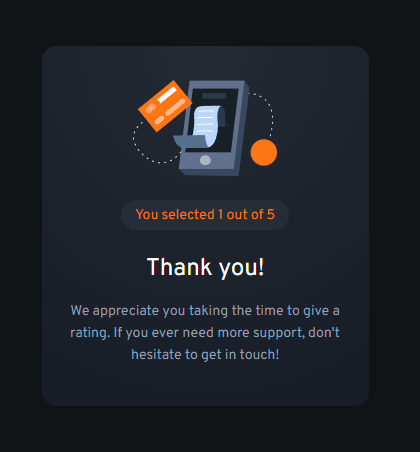

# interactive-rating-component

# Frontend Mentor - Interactive rating component solution

This is a solution to the [Interactive rating component challenge on Frontend Mentor](https://www.frontendmentor.io/challenges/interactive-rating-component-koxpeBUmI). Frontend Mentor challenges help you improve your coding skills by building realistic projects.

## Table of contents

- [interactive-rating-component](#interactive-rating-component)
- [Frontend Mentor - Interactive rating component solution](#frontend-mentor---interactive-rating-component-solution)
  - [Table of contents](#table-of-contents)
  - [Overview](#overview)
    - [The challenge](#the-challenge)
    - [Screenshot](#screenshot)
    - [Desktop Active](#desktop-active)
    - [Desktop Thank You](#desktop-thank-you)
    - [Mobile Active](#mobile-active)
    - [Mobile Thank You](#mobile-thank-you)
    - [Links](#links)
  - [My process](#my-process)
    - [Built with](#built-with)
    - [What I learned - TODO](#what-i-learned---todo)
    - [Continued development - TODO](#continued-development---todo)
    - [Useful resources - TODO](#useful-resources---todo)
  - [Author](#author)
  - [Recommended IDE Setup](#recommended-ide-setup)
  - [Customize configuration](#customize-configuration)
  - [Project Setup](#project-setup)
    - [Compile and Hot-Reload for Development](#compile-and-hot-reload-for-development)
    - [Compile and Minify for Production](#compile-and-minify-for-production)
    - [Run Unit Tests with Vitest](#run-unit-tests-with-vitest)
    - [Run End-to-End Tests with Cypress](#run-end-to-end-tests-with-cypress)
    - [Lint with ESLint](#lint-with-eslint)

**Note: Delete this note and update the table of contents based on what sections you keep.**

## Overview

### The challenge

Users should be able to:

- View the optimal layout for the app depending on their device's screen size
- See hover states for all interactive elements on the page
- Select and submit a number rating
- See the "Thank you" card state after submitting a rating

### Screenshot


### Desktop Active



### Desktop Thank You



### Mobile Active



### Mobile Thank You



### Links

- Solution URL: [Add solution URL here](https://github.com/rhickey94/rating-component)
- Live Site URL: [Add live site URL here](https://your-live-site-url.com)

## My process

### Built with

- Semantic HTML5 markup
- CSS custom properties
- Flexbox
- Mobile-first workflow
- [Vue](https://vuejs.org/) - JS framework

### What I learned - TODO

Use this section to recap over some of your major learnings while working through this project. Writing these out and providing code samples of areas you want to highlight is a great way to reinforce your own knowledge.

To see how you can add code snippets, see below:

```html
<h1>Some HTML code I'm proud of</h1>
```

```css
.proud-of-this-css {
  color: papayawhip;
}
```

```js
const proudOfThisFunc = () => {
  console.log("🎉");
};
```

### Continued development - TODO

Use this section to outline areas that you want to continue focusing on in future projects. These could be concepts you're still not completely comfortable with or techniques you found useful that you want to refine and perfect.

**Note: Delete this note and the content within this section and replace with your own plans for continued development.**

### Useful resources - TODO

- [Example resource 1](https://www.example.com) - This helped me for XYZ reason. I really liked this pattern and will use it going forward.
- [Example resource 2](https://www.example.com) - This is an amazing article which helped me finally understand XYZ. I'd recommend it to anyone still learning this concept.

**Note: Delete this note and replace the list above with resources that helped you during the challenge. These could come in handy for anyone viewing your solution or for yourself when you look back on this project in the future.**

## Author

- Website - [Add your name here](https://ryanhickey.dev)
- Frontend Mentor - [@rhickey94](https://www.frontendmentor.io/profile/rhickey94)

## Recommended IDE Setup

[VSCode](https://code.visualstudio.com/) + [Volar](https://marketplace.visualstudio.com/items?itemName=Vue.volar) (and disable Vetur) + [TypeScript Vue Plugin (Volar)](https://marketplace.visualstudio.com/items?itemName=Vue.vscode-typescript-vue-plugin).

## Customize configuration

See [Vite Configuration Reference](https://vitejs.dev/config/).

## Project Setup

```sh
npm install
```

### Compile and Hot-Reload for Development

```sh
npm run dev
```

### Compile and Minify for Production

```sh
npm run build
```

### Run Unit Tests with [Vitest](https://vitest.dev/)

```sh
npm run test:unit
```

### Run End-to-End Tests with [Cypress](https://www.cypress.io/)

```sh
npm run build
npm run test:e2e # or `npm run test:e2e:ci` for headless testing
```

### Lint with [ESLint](https://eslint.org/)

```sh
npm run lint
```
